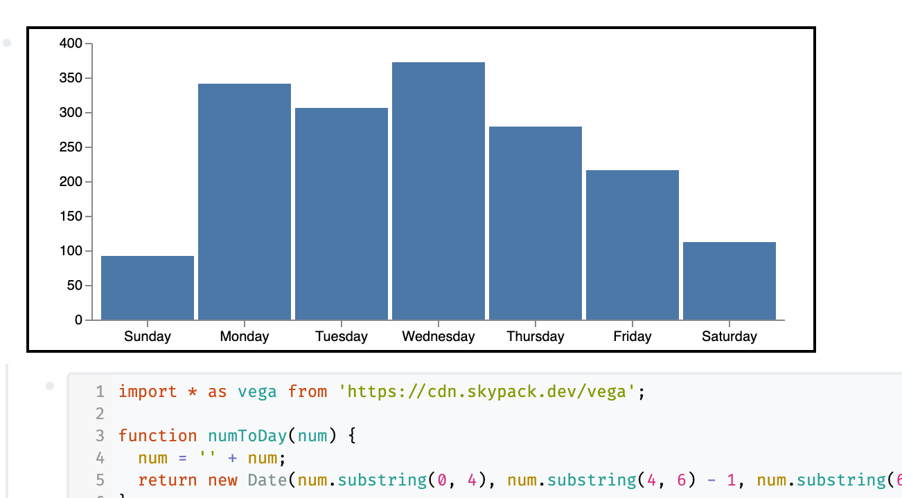

# Logseq JS Playground Plugin

Usage use `Add <JSPlay /> Block` command to initialize a JS playground, then
`export default` using ESM for what you want to render in the code block.

E.g., a Vega chart example to show a histogram of the number blocks created in each weekday. What it did:

- load ESM `vega` version with ESM import
- render some chart spec in SVG
- export it as default



```ts
import * as vega from "https://cdn.skypack.dev/vega";

function numToDay(num) {
  num = "" + num;
  return new Date(
    num.substring(0, 4),
    num.substring(4, 6) - 1,
    num.substring(6)
  ).getDay();
}

const blocksByDay = (
  await logseq.DB.datascriptQuery(`
  [:find ?d (count ?b)
  :where
  [?b :block/page ?p]
  [?p :block/journal? true]
  [?p :block/journal-day ?d]]
`)
).reduce((accum, curr) => {
  const day = numToDay(curr[0]);
  accum[day] = accum[day] ? accum[day] + curr[1] : curr[1];
  return accum;
}, {});

const weekdays = [
  "Sunday",
  "Monday",
  "Tuesday",
  "Wednesday",
  "Thursday",
  "Friday",
  "Saturday",
];

const arr = Object.entries(blocksByDay).map(([day, amount]) => ({
  day: weekdays[day],
  amount,
}));

const spec = {
  $schema: "https://vega.github.io/schema/vega/v5.json",
  description: "A basic stacked bar chart example.",
  width: 500,
  height: 200,
  padding: 5,

  data: [
    {
      name: "table",
      values: arr,
    },
  ],

  scales: [
    {
      name: "xscale",
      type: "band",
      domain: { data: "table", field: "day" },
      range: "width",
      padding: 0.05,
      round: true,
    },
    {
      name: "yscale",
      domain: { data: "table", field: "amount" },
      nice: true,
      range: "height",
    },
  ],

  axes: [
    { orient: "bottom", scale: "xscale" },
    { orient: "left", scale: "yscale" },
  ],

  marks: [
    {
      type: "rect",
      from: { data: "table" },
      encode: {
        enter: {
          x: { scale: "xscale", field: "day" },
          width: { scale: "xscale", band: 1 },
          y: { scale: "yscale", field: "amount" },
          y2: { scale: "yscale", value: 0 },
        },
      },
    },
  ],
};

const view = new vega.View(vega.parse(spec), { renderer: "none" });
const result = view.toSVG();
export default result;
```

The code is running in the Plugin context, so that you can combine any plugin
apis as you like. E.g., draw a chart for your Query etc.
